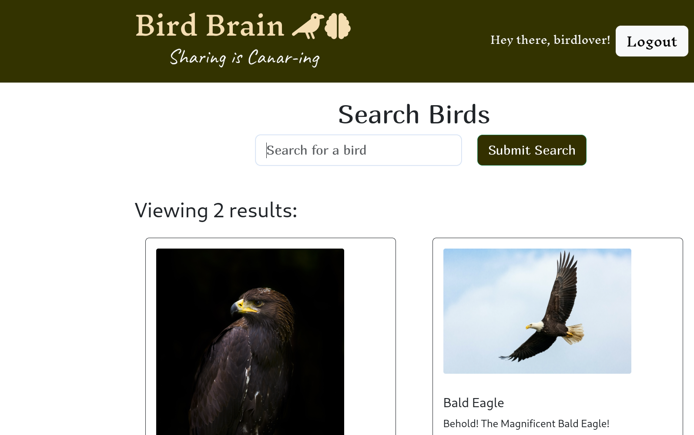

# Bird-Brain

## Description

(Unfortunately, this repository is still a work in progress.  We are still in the process of creation.  Come back soon to give it a try!)

Bird-Brain is a social media app where users can comment about birds and start a conversations with other people who love birds.  The complete application is in the folder containing this README and can be downloaded and installed locally (assuming the user has node.js and Mongo DB installed on their local machine) but we recommend using the copy already deployed to Heroku. [add link here!!!!!!!!!!!!!!!###################!!!!!!!!!!!!}  It was built around a full MERN (mongoDB, Express, React, Node) stack with Apollo and GraphQL connecting the front end to the back end. 

## Table of Contents

[Installation](#Installation)

[Usage](#Usage)

[Contributing](#Contributing)

[Tests](#Tests)

[License](#License)

[Questions](#Questions)

## Installation

Again, Bird-Brain has also been deployed to heroku{add link here!!!!!#############!!!!!!!!!!!], but if desired it can also be downloaded from this git repository and deployed locally.  The deployed version makes API calls to the [Nuthatch API](https://nuthatch.lastelm.software/), so to use it locally the user will have to request a key from from them.  With that in mind, to install it locally it is required that the user:

1. Request an API key from the [Nuthatch API](https://nuthatch.lastelm.software/).  At the time of this app's creation that was a relatively easy matter.  All that is required is that the user give an email address and a short answer to the question "How will you use this api?" Almost immediately after submitting the form an API key will be sent to your email address. 

2. Clone the repository into a folder in your local drive. 

3. Create a '.env' file and fill it out (as below) and save it to the folder that you cloned the repository into. 

		KEY = 'cut and past the API key from your email here'
		SECRET = 'type any random text here (even this text will work)'

4. With your terminal, enter into the folder where the repository was saved. 

5. Run "npm run install".  This is important because using just "npm install" may not install the dependencies of the client and server portions. 

6. Run "npm run Develop".  This will start the server and pull up the website in your browser.

7. Enjoy!

## Usage

When viewing the page, the user will see birds that have already Posted to provoke a discussion and a search bar.  After typing a bird name (or partial name) in the search bar and hitting "Submit Search", the user will get a list of one or more images of birds to choose from.  Hit the "Create Post" button to add your text to the bird.  After submitting the text with the bird, this bird and your "post" will be added to the list of Posts that are there for other users to view and start talking about.  

## Tests

We haven't created any tests that can independently be used to test this application. 

## License

We have included an MIT license with this Application which gives the user full access to use or modify the application as long as the license documentation is included in any additional copies.

## Questions/Comments

For any questions or comments about the application please contact Matt Wesley at [meugenewesley@gmail.com](mailto: meugenewesley@gmail.com)

## Contributing

This is a group project completed by Matt Wesley, Chris Messa, Adorah Tho, Michael Escribano, and Brian Wiley. 

If one would like to contribute to the repository as well feel free to email Matt Wesley at [meugenewesley@gmail.com](mailto: meugenewesley@gmail.com).  
